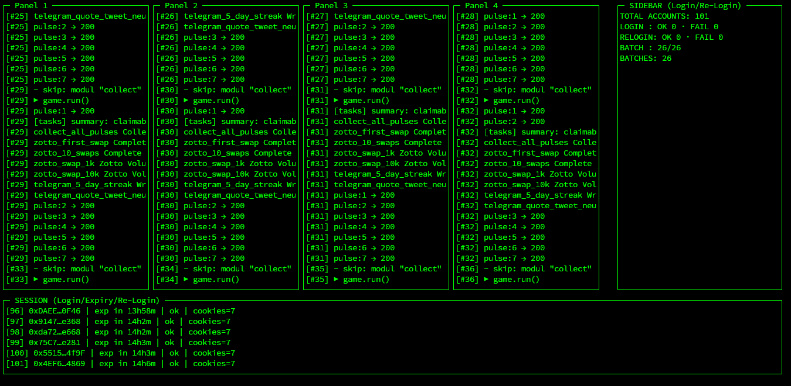

# Is free no need money multi account and proxy




# clone
```
git clone https://github.com/Wawanahayy/neura
```

# install 
```
npm i axios yaml ethers https-proxy-agent socks-proxy-agent blessed dotenv
```

### set privatekey and proxy on .env or on privatekeys.txt

### auto use other config on config.yaml

```
node auto.mjs
```
or
```
node gameplay.mjs
```

## do you like?
### this script open source you can DM me or create issue
### support me
X : https://x.com/Wawanahayy
Tg: https://t.me/timplexz
channel: https://t.me/AirdropJP_JawaPride


### .env create .env use nano .env or new folder .env
paste code this
api key from : https://2captcha.com/

```
PRIVY_BASE=https://privy.neuraprotocol.io
NEURAVERSE_ORIGIN=https://neuraverse.neuraprotocol.io
DOMAIN=neuraverse.neuraprotocol.io
PRIVY_APP_ID=cmbpempz2011ll10l7iucga14
PRIVY_CA_ID=8aa77d44-b1aa-4107-9c02-f4c3037e1726
CHAIN_ID_NUM=267
SEPOLIA_RPC=https://sepolia.drpc.org
NEURA_RPC=https://testnet.rpc.neuraprotocol.io
PRIVATE_KEYS_FILE=./privatekeys.txt
PROXIES_FILE=./proxies.txt
ALLOW_NO_PROXY_ON_SIWE=1
ALTERNATE_CA_ID=0e093b46-721c-473c-9f6d-0b9708747506
API_KEY=
TURNSTILE_PAGE_URL=https://privy.neuraprotocol.io
TURNSTILE_PAGE_URL=https://neuraverse.neuraprotocol.io
MAX_WAIT_SEC=300
POLL_MS=5000 
GRAPH_URL=https://http-testnet-graph-eth.infra.neuraprotocol.io/subgraphs/name/test-eth
PRIVATE_KEY=
PRIVATE_KEYS_FILE=./privatekeys.
SIWE_TIMEOUT_MS=0
SIWE_AUTH_TRIES=3
SIWE_AUTH_BASE_MS=800
SIWE_AUTH_BACKOFF=1.8
SIWE_AUTH_JITTER=250
TURNSTILE_SITE_KEY=0x4AAAAAAAM8ceq5KhP1uJBt
ROUTE=ankr2ztusd,ztusdc2ankr
```
